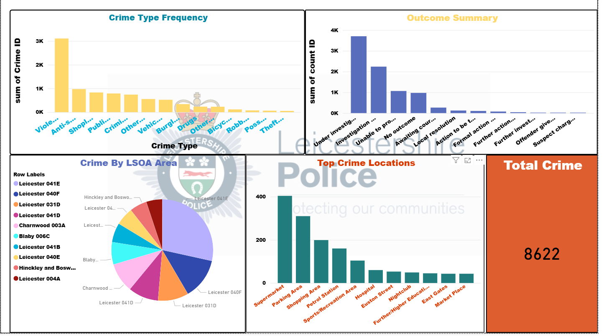

# 📊 Crime Data Visualization Dashboard

## 📌 Project Overview
This project is a **Crime Data Visualization Dashboard** presenting crime statistics for the Leicestershire Police jurisdiction.  
The dashboard delivers insights into crime types, locations, and investigation outcomes, helping identify key patterns and trends.

## ✨ Features
- **Crime Type Frequency**: Bar chart showing the most common types of crimes (e.g., Violence, Anti-social behaviour, Shoplifting).
- **Outcome Summary**: Visual breakdown of investigation results such as "Under Investigation", "No Outcome", and "Prosecution".
- **Crime by LSOA Area**: Pie chart distribution of crimes across different LSOA regions.
- **Top Crime Locations**: Identifies high-crime areas like supermarkets, parking zones, and shopping centres.
- **Total Crime Count**: Overall number of recorded crimes displayed prominently.

## 📂 Data Sources
- Crime data sourced from **Leicestershire Police** (Open Data / official datasets).
- Data processed and visualized using [replace with your tool: **Power BI**, **Python (Pandas, Matplotlib)**, or **Excel**].

## 🛠️ Tools & Technologies
- **Data Analysis**: Python (Pandas, NumPy) / Excel
- **Visualization**: Power BI / Matplotlib / Seaborn
- **Data Cleaning**: Python, Excel

## 📷 Dashboard Preview


## 📈 Insights from the Dashboard
- **Violence** and **Anti-social Behaviour** are the most reported crime categories.
- The majority of cases remain **under investigation**.
- **Supermarkets** and **Parking Areas** are the top targeted crime locations.
- Certain LSOA areas, such as **Leicester 041E**, have notably higher crime rates.

## 🚀 How to Use
1. **Clone the repository**:
   ```bash
   git clone https://github.com/your-username/your-repo-name.git
